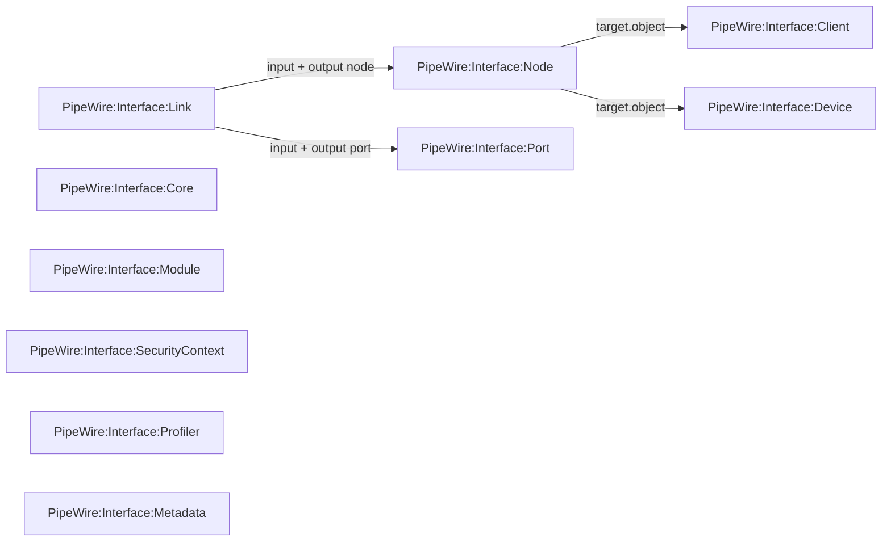

\page page_overview_for_users Overview for Users

While the \ref page_overview page describes PipeWire on a technical level for programmers,
this page is intended for end users working with (and not programming on) PipeWire.

# PipeWire

- [docs.pipewire.org: PipeWire docs](https://docs.pipewire.org/) – that’s this page
- [pipewire.pages.freedesktop.org: WirePlumber docs](https://pipewire.pages.freedesktop.org/wireplumber/) – WirePlumber reference
- [gitlab.freedesktop.org Wiki](https://gitlab.freedesktop.org/pipewire/pipewire/-/wikis/home) with guides and links to other docs
- [wiki.archlinux.org: ArchLinux docs](https://wiki.archlinux.org/title/PipeWire) with tool list and examples

PipeWire is a multimedia framework for Linux. The Kernel uses ALSA, and applications can either use ALSA directly
(but only one application send sound to an ALSA output at the same time), or use a different backend like JACK,
PulseAudio, or (the newest) PipeWire. All those backends do not have the single client limitation and provide
additional features.

PipeWire uses a powerful graph based approach for routing application freely between producers and consumers.

PipeWire provides a PulseAudio API (and others like JACK), so clients relying on PulseAudio still work,
they just use the PulseAudio API provided by PipeWire. Therefore, PulseAudio tools like `pavucontrol` still work
(see PulseAudio section below).


## PipeWire overview

Normally, a system with PipeWire also runs WirePlumber.

**PipeWire** only *provides* the functionality for transporting and transforming audio and video. It is *used* by a session manager.

There is one PipeWire *server* which is used by a number of PipeWire *clients* (the processes that produce/consume multimedia).
PipeWire, as well as WirePlumber, run in *userspace,* so interfacing with them with `systemd` (and `journald` etc.)
happens in *user context* with the `--user` flag, for example
`systemctl --user status pipewire.service` or `journalctl --user -fu wireplumber.service`.

**WirePlumber** provides [Session Management](https://pipewire.pages.freedesktop.org/wireplumber/design/understanding_session_management.html): It enables new devices when they appear on ALSA, creates and configures nodes,
create links between nodes to route sound from an application to a consumer, etc.

### Terminology

For a more technical description, see \ref page_overview.

* **Nodes** produce and/or consume data, for example a stereo output to a headset (consumes), an audio player (produces),
  a reverb effect filter (consumes, then produces modified audio), etc.
* **Ports** are the connectors on nodes where data enters or exits. A stereo output sound card has two input ports
  typically labeled `FL` and `FR` for front left and front right, which may receive data from `vlc` which has
  two output ports `FL` and `FR`. (Physically, the sound card can have a stereo jack output, for example, but that is not in the scope of PipeWire.)
* **Links** connect two ports. Audio/Video data only flows when there is a link between ports.
  Ports can have multiple incoming/outgoing links, so PipeWire can e.g. send the same `vlc` audio stream to the stereo headset
  and a bluetooth headset and an audio recorder.
* **Devices** represent e.g. ALSA PCM sound cards. They have *Profiles*, and the active profile defines properties
  like channel setup. For example, a sound card can have a `stereo` profile where only two ports are exposed,
  or a `surround7.1` profile with 8 ports available.

Nodes have various properties like name/description, a vendor (if available), an ID (changes between restart, therefore use `node.name` or `device.name`), etc.
Some specific properties:

* `media.class` describes the type of the node. A sound card (a *device* in PipeWire) has media class `Audio/Device`
  with corresponding `Audio/Source` input and  `Audio/Sink` output nodes. A process producing audio is `Stream/Output/Audio`.

Relationships between different object types (`type` property):





### PipeWire Tools

* [List of PipeWire programs](https://docs.pipewire.org/page_programs.html)

This is just a short selection of tools.

[qpwgraph](https://gitlab.freedesktop.org/rncbc/qpwgraph) gives a quick visual overview over the current system configuration with nodes and links between them.
It also allows creating and deleting links on the fly.

`pw-dump` dumps the whole configuration (json dump all, nodes etc)

`pw-cli` allows to query and configure PipeWire, for example setting a sound card profile with
`pw-cli s Profile CARD_ID '{index: PROFILE_ID, save: true}'`, or in interactive mode.
*Important:* In interactive mode, do *not* use quotes around JSON data.

`wpctl` interfaces with WirePlumber, for example `wpctl status` shows an ASCII representation of the nodes, sources, sinks, and routing.

### WirePlumber

WirePlumber creates links based on defaults and priorities as described in [Linking Policy](https://pipewire.pages.freedesktop.org/wireplumber/policies/linking.html).
For example, when an application starts audio playback, it links to the default sound output like the Bluetooth headset.
If that output disappears, it dynamically chooses the next suitable output device.

### Configuration files and rules

* [PipeWire docs: configuration overview](https://docs.pipewire.org/page_config.html)

Both PipeWire and WirePlumber have a set of config files for configuring different parts. They use the same format.

Rules in config file can define default outputs for specific nodes (e.g. VLC sound always goes to the 7.1 sound card).
[ArchLinux: WirePlumber](https://wiki.archlinux.org/title/WirePlumber) gives a short introduction to using them.

**PipeWire server configuration** configures the PipeWire instance, defines which modules PipeWire should load, adds device rules, etc.

* Location: `pipewire/pipewire.conf`
* Docs: [pipewire.conf](https://docs.pipewire.org/page_man_pipewire_conf_5.html)
* Configures: `context.exec`,  `context.modules`, `context.properties`, `context.spa-libs`, `device.rules`, `node.rules`

**PipeWire client configuration** contains configuration for PipeWire and ALSA clients, e.g. if VLC uses the PipeWire or ALSA backend,
its runtime behaviour can be modified with this configuration.
Example: A stream rule defines to always route `vlc` sound output to Bluetooth earbuds and `pw-play` to a stereo headset.

* Location: `pipewire/client.conf`, for example `~/.config/pipewire/client.conf.d/`
* Docs: [client.conf](https://docs.pipewire.org/page_man_pipewire-client_conf_5.html) and [PipeWire object property reference](https://docs.pipewire.org/page_man_pipewire-props_7.html) (also contains WirePlumber related options!)
* Configures: `alsa.properties`, `alsa.rules`, `stream.properties`, `stream.rules`

**PulseAudio/JACK configuration** contains configuration for PipeWire’s PulseAudio and JACK servers.

* Docs: [pipewire-pulse.conf](https://docs.pipewire.org/page_man_pipewire-pulse_conf_5.html), [jack.conf](https://docs.pipewire.org/page_man_pipewire-jack_conf_5.html)

**WirePlumber configuration** configures general WirePlumber aspects (should it even bring up ALSA devices
or save/restore user settings configured with e.g. `pavucontrol`) and also ALSA/Bluetooth monitor aspects
(choosing a default profile like Stereo or 7.1, setting device priorities that affect default routing, setting device properties, etc.).

* Location: `wireplumber.conf`, e.g. `~/.config/wireplumber/wireplumber.conf.d/`

* Docs: [WirePlumber daemon configuration](https://pipewire.pages.freedesktop.org/wireplumber/daemon/configuration.html) and more like [ALSA configuration](https://pipewire.pages.freedesktop.org/wireplumber/daemon/configuration/alsa.html)
* Configures: `context`, `device`, `linking`, `wireplumber`, `monitor` (like `monitor.alsa.properties`, `monitor.alsa.rules`), `node` (like `node.software-dsp`),`support`, `policy`


#### Writing Rules and Examples

Rules can use regular expression when strings start with `~`, as explained in [PipeWire: Working with rules](https://pipewire.pages.freedesktop.org/wireplumber/daemon/configuration/modifying_configuration.html#working-with-rules).

```text
# Goes to ~/.config/wireplumber/wireplumber.conf.d/wireplumber-default-device.conf
# Restart wireplumber.service so it loads the rules
# This sample rule increases the priority of the stereo output on a Raspberry Pi,
# so it is used by default.
monitor.alsa.rules = [
  {
    matches = [
      {
        node.name = "alsa_output.platform-fe00b840.mailbox.stereo-fallback"
      }
    ]
    actions = {
      update-props = {
        priority.driver = 3000
        priority.session = 3000
      }
    }
  }
]

```

```text
# Goes to ~/.config/pipewire/client.conf.d/default-pw-play-output.conf
# Restart wireplumber.service so it loads the rules
# This sample rule uses a specific sound card for playback with pw-play.
# If it does not exist, WirePlumber takes the next suitable one.
stream.rules = [
  {
    matches = [
      {
        application.name = "pw-play"
      }
    ]
    actions = {
      update-props = {
        target.object = "alsa_output.usb-PreSonus_Audio_AudioBox_USB-01.pro-output-0"
      }
    }
  }
]

```


### Debugging

* Setting WirePlumber log level: https://pipewire.pages.freedesktop.org/wireplumber/daemon/logging.html
* `pw-play --target [ID|node.name] myfile.mp3` plays a sound file and tries to use the given target; useful for trying to find out the correct target
* [Automatically Link Pipewire Nodes with Wireplumber](https://bennett.dev/auto-link-pipewire-ports-wireplumber/)


## PulseAudio API

* [Migrating from PulseAudio to PipeWire](https://gitlab.freedesktop.org/pipewire/pipewire/-/wikis/Migrate-PulseAudio)
* [PulseAudio clients and usage](https://gitlab.freedesktop.org/pipewire/pipewire/-/wikis/Config-PulseAudio) for PipeWire

 Many PulseAudio tools also work for PipeWire, like:

* `pavucontrol` (GUI to configure sound cards, select profiles, etc.)
* `pactl` (CLI configuration tool, e.g. for setting the default audio sink)
* `paplay` and `parecord` for playing and recording audio

